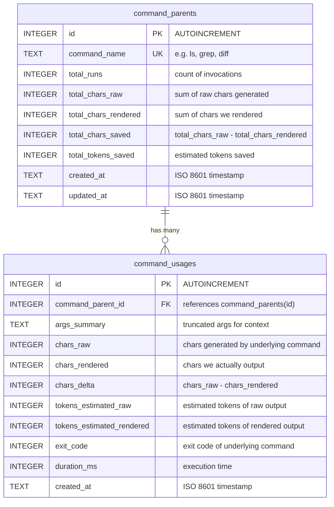

# feat: Yeet — Token-Optimized CLI Wrapper

## Overview

Build a Go CLI binary called `yeet` that wraps common system commands (`ls`, `cat`, `grep`, `find`, `diff`) and produces noise-filtered, compact output optimized for LLM token consumption. Every invocation records character/token analytics in a local SQLite database with two tables: `command_parents` (aggregate stats per command type) and `command_usages` (per-invocation details with FK to parent).

## Problem Statement / Motivation

Standard Unix commands produce verbose output designed for human readability — permission bits, timestamps, counting progress, delta compression stats, etc. When these outputs are consumed by LLMs (e.g., Claude Code), the noise wastes context window tokens. A `git push` that outputs 15 lines (~200 tokens) could be reduced to 1 line (~10 tokens) while preserving all useful information.

**Goal:** Reduce token consumption by 50-80% for common CLI operations while preserving semantic content.

## Proposed Solution

A single Go binary (`yeet`) using Cobra for subcommand dispatch. Each wrapped command has a dedicated handler that:
1. Executes the underlying command (or implements natively in Go for better control)
2. Filters/transforms output into a compact format
3. Records raw vs. rendered character counts in SQLite
4. Prints the optimized output to stdout

### Commands

| Command | Description | Implementation Strategy |
|---------|-------------|------------------------|
| `yeet ls [path]` | Token-optimized directory tree | **Native Go** — `filepath.WalkDir` with ignore rules |
| `yeet read <file>` | Smart file reading | **Native Go** — `os.ReadFile` with line numbers |
| `yeet read <file> -l aggressive` | Signatures only (strip bodies) | **Native Go** — regex-based signature extraction |
| `yeet smart <file>` | File summary: type, line count, top-level declarations | **Native Go** — heuristic scan |
| `yeet find <pattern> [path]` | Compact find results | **Native Go** — `filepath.WalkDir` + glob match |
| `yeet grep <pattern> [path]` | Grouped search results | **Shell out** to `grep -rn`, then reformat output |
| `yeet diff <file1> <file2>` | Condensed unified diff | **Shell out** to `diff -u`, then strip noise |
| `yeet stats` | View analytics dashboard | **Native Go** — query SQLite |

## Technical Approach

### Architecture

```
yeet/
├── cmd/
│   └── yeet/
│       └── main.go              # Entry point — minimal, calls cli.Execute()
├── internal/
│   ├── cli/
│   │   ├── root.go              # Root Cobra command, persistent flags
│   │   ├── ls.go                # yeet ls
│   │   ├── read.go              # yeet read
│   │   ├── smart.go             # yeet smart
│   │   ├── find.go              # yeet find
│   │   ├── grep.go              # yeet grep
│   │   ├── diff.go              # yeet diff
│   │   └── stats.go             # yeet stats
│   ├── exec/
│   │   └── runner.go            # os/exec wrapper — capture stdout/stderr, exit codes
│   ├── filter/
│   │   ├── tree.go              # Directory tree builder + renderer
│   │   ├── signatures.go        # Language-aware signature extraction
│   │   ├── summary.go           # File summary heuristic (yeet smart)
│   │   └── diff.go              # Diff output compactor
│   ├── ignore/
│   │   └── ignore.go            # .gitignore + hardcoded ignore rules
│   ├── token/
│   │   └── estimator.go         # Character-based token estimation
│   └── analytics/
│       ├── db.go                # SQLite schema, open, migrate
│       ├── record.go            # Insert/update analytics
│       └── query.go             # Read analytics for yeet stats
├── go.mod
├── go.sum
└── Makefile
```

### Dependencies

| Dependency | Version | Purpose |
|-----------|---------|---------|
| `github.com/spf13/cobra` | v1.10+ | CLI framework with subcommand dispatch |
| `modernc.org/sqlite` | v1.37+ | CGo-free SQLite driver |

No other external dependencies. Use Go stdlib for everything else (`os/exec`, `filepath`, `regexp`, `bufio`, `database/sql`).

### Implementation Phases

#### Phase 1: Foundation (Scaffold + Analytics + `yeet ls`)

**Goal:** Working binary with one command and full analytics pipeline.

**Tasks:**
- [ ] Initialize Go module (`go mod init github.com/<user>/yeet`)
- [ ] Set up Cobra root command in `internal/cli/root.go` with persistent flags:
  - `--no-analytics` — disable SQLite recording
  - `--raw` — pass through unfiltered output
- [ ] Implement SQLite analytics in `internal/analytics/db.go`:
  - DB location: `~/.local/share/yeet/analytics.db` (via `os.UserHomeDir()`)
  - Auto-create directory and schema on first use
  - WAL journal mode, foreign keys enabled
  - Schema (see ERD below)
- [ ] Implement analytics recording in `internal/analytics/record.go`:
  - `RecordUsage(command, rawChars, renderedChars)` — handles upsert of parent + insert of usage
  - Uses a transaction to avoid race conditions on aggregate updates
- [ ] Implement `yeet ls` in `internal/cli/ls.go` + `internal/filter/tree.go`:
  - Native Go `filepath.WalkDir`
  - Default depth: 3 levels
  - Hardcoded ignore list: `.git`, `node_modules`, `__pycache__`, `.venv`, `vendor`, `dist`, `build`, `target`, `.next`, `.cache`
  - Respect `.gitignore` if present (parse manually — simple line-by-line glob matching)
  - Collapse single-child directories: `src/main/java/` → one line
  - Show file counts for directories with >10 files: `assets/ (347 files)`
  - Tree rendering with `├──`, `└──`, `│` characters
- [ ] Implement token estimator in `internal/token/estimator.go`:
  - `EstimateTokens(text string) int` — `(len(text) + 3) / 4`
- [ ] Wire up `cmd/yeet/main.go`
- [ ] Build and test: `go build -o yeet ./cmd/yeet/`

**Success criteria:** `yeet ls .` produces a clean tree, analytics DB is created and populated.

#### Phase 2: Core Commands (`read`, `smart`, `find`, `grep`, `diff`)

**Tasks:**
- [ ] Implement `yeet read <file>` in `internal/cli/read.go`:
  - Default: print file with line numbers, no extra noise
  - `-l aggressive` flag: extract signatures only
  - Binary file detection: if file contains null bytes in first 512 bytes, print `"binary file, N bytes"` instead
- [ ] Implement signature extraction in `internal/filter/signatures.go`:
  - **v1 languages:** Go, Rust, Python, TypeScript/JavaScript
  - **Go:** lines matching `^func `, `^type `, `^var `, `^const `, `^package `
  - **Rust:** lines matching `^pub `, `^fn `, `^struct `, `^enum `, `^trait `, `^impl `, `^mod `, `^use `
  - **Python:** lines matching `^def `, `^class `, `^import `, `^from `
  - **TypeScript/JS:** lines matching `^export `, `^function `, `^class `, `^interface `, `^type `, `^import `
  - Language detected by file extension
  - **Fallback for unsupported languages:** print full file with a stderr warning
- [ ] Implement `yeet smart <file>` in `internal/cli/smart.go` + `internal/filter/summary.go`:
  - Output format (2 lines):
    ```
    Go source | 245 lines | 6.2 KB
    exports: HandleRequest, NewServer, Config (struct), ErrTimeout (var)
    ```
  - Line 1: language, line count, file size
  - Line 2: top-level exported/public declarations (up to 10, then `... and N more`)
- [ ] Implement `yeet find <pattern> [path]` in `internal/cli/find.go`:
  - Native Go `filepath.WalkDir` + `filepath.Match` for glob
  - Respects same ignore rules as `yeet ls`
  - Output: one path per line, relative to search root
  - Show match count at end: `(found 23 files)`
- [ ] Implement `yeet grep <pattern> [path]` in `internal/cli/grep.go`:
  - Shell out to `grep -rn --include=<ext>` (or `rg` if available)
  - Reformat output grouped by file:
    ```
    src/main.rs (3 matches)
      42: fn handle_request(req: Request) {
      87: fn handle_response(res: Response) {
     103: fn handle_error(err: Error) {
    ```
  - Fallback: native Go `regexp` + `filepath.WalkDir` if grep not found
  - Respects same ignore rules
- [ ] Implement `yeet diff <file1> <file2>` in `internal/cli/diff.go` + `internal/filter/diff.go`:
  - Shell out to `diff -u`
  - Strip header noise (timestamps, etc.)
  - Reduce context lines from default 3 to 1
  - Show summary: `(+12 -5 lines in 3 hunks)`
  - Fallback: use `github.com/sergi/go-diff` if diff not in PATH (add as optional dependency)

**Success criteria:** All 7 commands work, analytics records every invocation.

#### Phase 3: Analytics Dashboard + Polish

**Tasks:**
- [ ] Implement `yeet stats` in `internal/cli/stats.go` + `internal/analytics/query.go`:
  - Show per-command breakdown:
    ```
    Command    Runs   Chars Raw   Chars Rendered   Saved    Tokens Saved
    ls          42      85,200        12,300       85.6%      18,225
    grep        18      34,100         8,400       75.4%       6,425
    read        31      62,000        41,000       33.9%       5,250
    ─────────────────────────────────────────────────────────────────
    Total       91     181,300        61,700       66.0%      29,900
    ```
  - Optional `--json` flag for machine-readable output
  - Optional `--reset` flag to clear analytics
- [ ] Add `yeet version` (embed via `go build -ldflags`)
- [ ] Add Makefile with targets: `build`, `install`, `test`, `clean`
- [ ] Error handling polish:
  - All errors to stderr
  - Exit codes: 0 = success, 1 = command error, 2 = bad usage
  - Analytics errors are non-fatal (log to stderr, don't block command output)
- [ ] Add `YEET_NO_ANALYTICS=1` env var support alongside `--no-analytics` flag

**Success criteria:** `yeet stats` shows accurate cumulative data across sessions.

### Database Schema (ERD)



### SQL Schema

```sql
CREATE TABLE IF NOT EXISTS command_parents (
    id                    INTEGER PRIMARY KEY AUTOINCREMENT,
    command_name          TEXT    NOT NULL UNIQUE,
    total_runs            INTEGER NOT NULL DEFAULT 0,
    total_chars_raw       INTEGER NOT NULL DEFAULT 0,
    total_chars_rendered  INTEGER NOT NULL DEFAULT 0,
    total_chars_saved     INTEGER NOT NULL DEFAULT 0,
    total_tokens_saved    INTEGER NOT NULL DEFAULT 0,
    created_at            TEXT    NOT NULL DEFAULT (strftime('%Y-%m-%dT%H:%M:%fZ', 'now')),
    updated_at            TEXT    NOT NULL DEFAULT (strftime('%Y-%m-%dT%H:%M:%fZ', 'now'))
);

CREATE TABLE IF NOT EXISTS command_usages (
    id                        INTEGER PRIMARY KEY AUTOINCREMENT,
    command_parent_id         INTEGER NOT NULL,
    args_summary              TEXT,
    chars_raw                 INTEGER NOT NULL,
    chars_rendered            INTEGER NOT NULL,
    chars_delta               INTEGER NOT NULL,
    tokens_estimated_raw      INTEGER NOT NULL,
    tokens_estimated_rendered INTEGER NOT NULL,
    exit_code                 INTEGER NOT NULL DEFAULT 0,
    duration_ms               INTEGER NOT NULL DEFAULT 0,
    created_at                TEXT    NOT NULL DEFAULT (strftime('%Y-%m-%dT%H:%M:%fZ', 'now')),
    FOREIGN KEY (command_parent_id) REFERENCES command_parents(id)
);

CREATE INDEX IF NOT EXISTS idx_usages_parent ON command_usages(command_parent_id);
CREATE INDEX IF NOT EXISTS idx_usages_created ON command_usages(created_at);
```

### Analytics Recording Flow

```
RecordUsage(commandName, rawChars, renderedChars, exitCode, durationMs, argsSummary):
  BEGIN TRANSACTION
    -- Upsert command_parent
    INSERT INTO command_parents (command_name, total_runs, total_chars_raw, total_chars_rendered, total_chars_saved, total_tokens_saved)
    VALUES (commandName, 1, rawChars, renderedChars, rawChars - renderedChars, (rawChars - renderedChars + 3) / 4)
    ON CONFLICT(command_name) DO UPDATE SET
      total_runs           = total_runs + 1,
      total_chars_raw      = total_chars_raw + rawChars,
      total_chars_rendered = total_chars_rendered + renderedChars,
      total_chars_saved    = total_chars_saved + (rawChars - renderedChars),
      total_tokens_saved   = total_tokens_saved + ((rawChars - renderedChars + 3) / 4),
      updated_at           = strftime('%Y-%m-%dT%H:%M:%fZ', 'now');

    -- Get the parent ID
    SELECT id FROM command_parents WHERE command_name = commandName;

    -- Insert usage row
    INSERT INTO command_usages (command_parent_id, args_summary, chars_raw, chars_rendered, chars_delta,
                                tokens_estimated_raw, tokens_estimated_rendered, exit_code, duration_ms)
    VALUES (parentId, argsSummary, rawChars, renderedChars, rawChars - renderedChars,
            (rawChars + 3) / 4, (renderedChars + 3) / 4, exitCode, durationMs);
  COMMIT
```

## Technical Considerations

### Signature Extraction (`-l aggressive`)

**v1 scope:** Go, Rust, Python, TypeScript/JavaScript only. Uses line-level regex matching (not AST parsing). This is intentionally simple — it catches 90% of signatures for common code patterns. Full AST parsing (e.g., tree-sitter) is a future enhancement.

**Fallback:** For unsupported file extensions, print the full file content with a stderr note: `yeet: aggressive mode not supported for .xyz files, showing full content`.

**Language detection:** By file extension mapping:
- `.go` → Go
- `.rs` → Rust
- `.py` → Python
- `.ts`, `.tsx`, `.js`, `.jsx` → TypeScript/JavaScript

### `.gitignore` Support

For v1, implement simple `.gitignore` parsing:
- Read `.gitignore` from the root of the search path
- Support basic glob patterns (`*.log`, `build/`, `!important.log`)
- Do NOT support nested `.gitignore` files (simplification for v1)
- Always ignore hardcoded patterns (`.git`, `node_modules`) regardless of `.gitignore`

### Concurrency Safety

- SQLite opened with WAL mode and `_busy_timeout=5000`
- All analytics writes wrapped in a single transaction
- `db.SetMaxOpenConns(1)` — SQLite serializes writes anyway
- Analytics errors are logged to stderr but never fatal

### Cross-Platform

- Primary targets: macOS (arm64, amd64), Linux (amd64, arm64)
- `yeet ls`, `yeet read`, `yeet smart`, `yeet find` are 100% native Go — work everywhere
- `yeet grep` and `yeet diff` shell out but have native Go fallbacks
- Path handling via `filepath.Join` throughout
- Config dir via `os.UserHomeDir()` + `/.local/share/yeet/`

### Error Handling

- All errors to stderr, command output to stdout only
- Exit codes: `0` success, `1` command error, `2` bad usage
- Analytics errors are non-fatal — never block command output
- Binary file detection for `yeet read` — avoid dumping raw bytes

## Acceptance Criteria

### Functional Requirements

- [ ] `yeet ls .` produces a compact directory tree with ignore rules applied
- [ ] `yeet read <file>` prints file with line numbers
- [ ] `yeet read <file> -l aggressive` shows only function/type signatures for supported languages
- [ ] `yeet smart <file>` produces a 2-line summary (language/size + declarations)
- [ ] `yeet find "*.rs" .` lists matching files compactly
- [ ] `yeet grep "pattern" .` shows results grouped by file
- [ ] `yeet diff file1 file2` shows condensed unified diff
- [ ] `yeet stats` displays analytics dashboard
- [ ] Every command invocation creates a `command_usages` row
- [ ] First invocation of a command type creates a `command_parents` row
- [ ] Subsequent invocations update aggregate columns on `command_parents`
- [ ] `--no-analytics` flag and `YEET_NO_ANALYTICS=1` env var disable SQLite recording
- [ ] Binary builds with `go build ./cmd/yeet/`

### Non-Functional Requirements

- [ ] All errors go to stderr, only filtered output goes to stdout
- [ ] Exit codes: 0 (success), 1 (error), 2 (bad usage)
- [ ] Analytics errors are non-fatal
- [ ] Works on macOS and Linux without external dependencies
- [ ] SQLite DB auto-creates on first use at `~/.local/share/yeet/analytics.db`

## Success Metrics

- **Token reduction:** ≥50% fewer characters for `yeet ls` vs `ls -la` on typical projects
- **Token reduction:** ≥70% fewer characters for `yeet grep` vs raw `grep -rn` output
- **Reliability:** Analytics DB handles concurrent access without corruption
- **Binary size:** <15MB (Go static binary with SQLite)

## Dependencies & Risks

| Risk | Impact | Mitigation |
|------|--------|------------|
| Signature extraction is brittle for edge cases | Medium | Regex-based v1 with explicit fallback; scope to 4 languages |
| SQLite corruption from concurrent writes | Low | WAL mode + busy timeout + transactions |
| `.gitignore` parsing doesn't cover all edge cases | Low | Start with simple glob matching; enhance later |
| Binary size bloat from SQLite | Low | modernc.org/sqlite adds ~8MB; acceptable for a dev tool |

## Sources & References

### External References

- Cobra documentation: https://pkg.go.dev/github.com/spf13/cobra
- modernc.org/sqlite: https://pkg.go.dev/modernc.org/sqlite
- SQLite WAL mode: https://www.sqlite.org/wal.html
- Go filepath.WalkDir: https://pkg.go.dev/path/filepath#WalkDir
- Go os/exec: https://pkg.go.dev/os/exec
